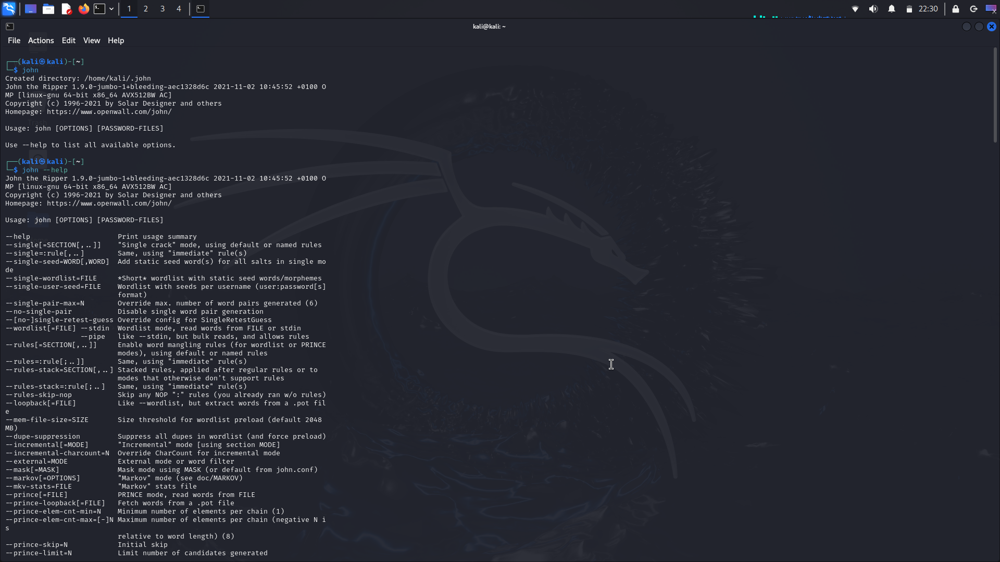
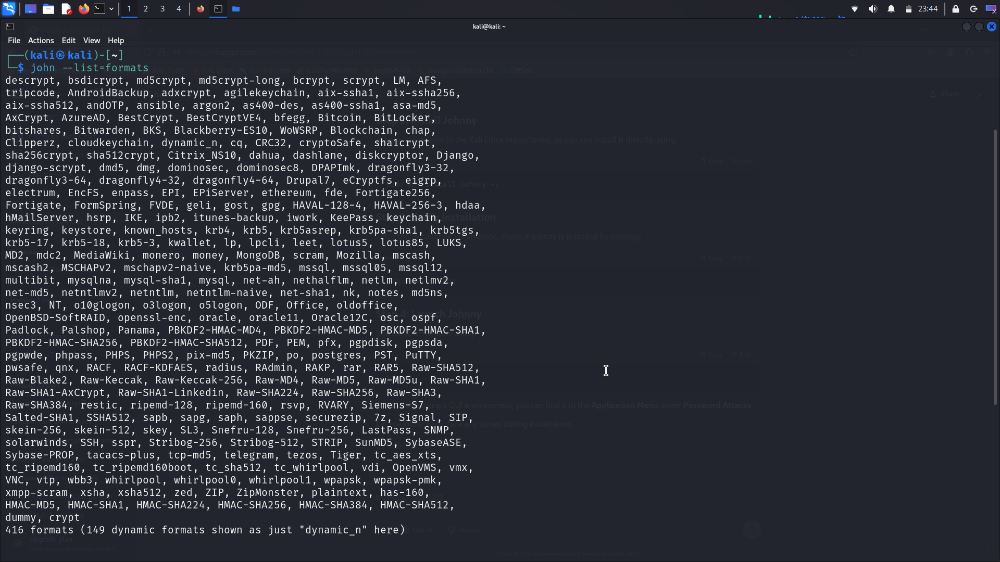
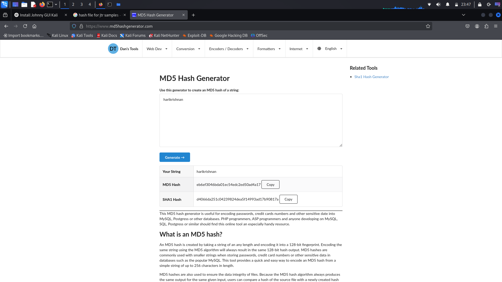
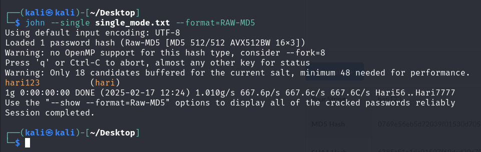
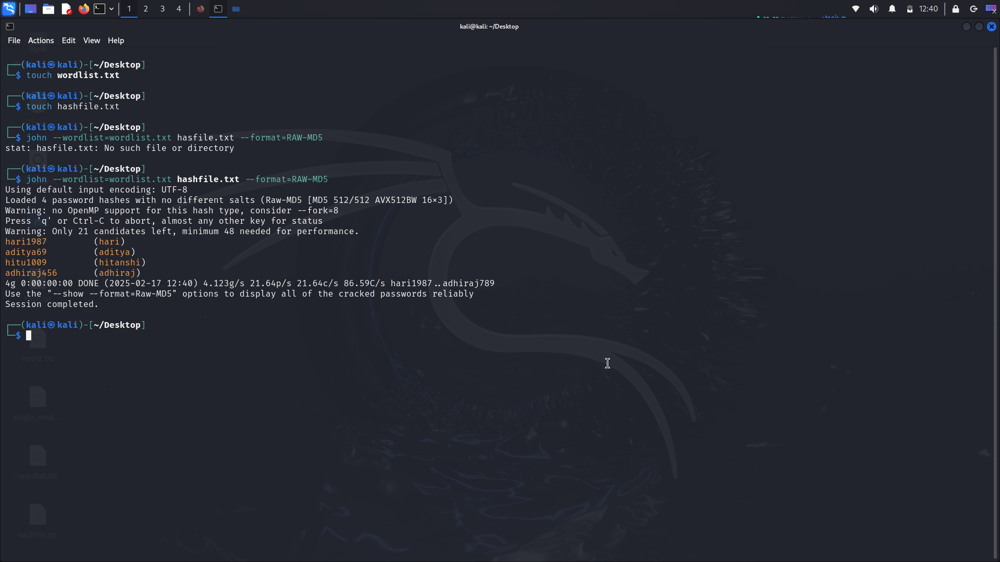
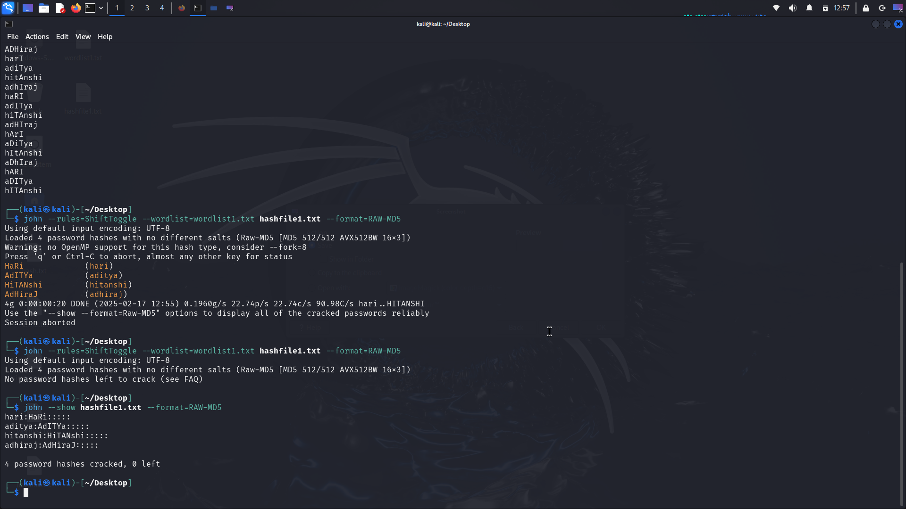
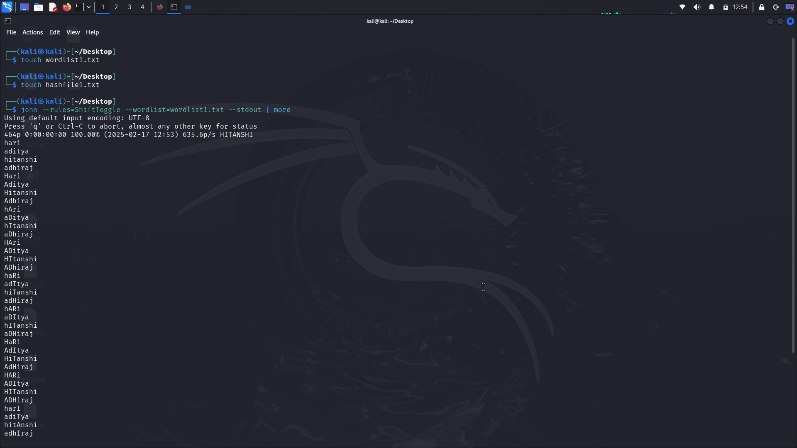

# John the Ripper Demonstration

## Team Members
- Hitanshi Patil - 16010122283
- Harikrishnan Gopal - 16010122284
- Aditya Raut - 16010122288
- Adhiraj Patole – 16010122294

TY BTech Computer Engineering  
B Division | B-4 Batch

## Introduction
This repository provides a demonstration of John the Ripper (JtR), a popular password cracking tool. The documentation includes screenshots covering various cracking modes, hash formats, GUI usage, and multiprocessing with forks.

## Contents

### 1. Introduction to John the Ripper
- Overview of John the Ripper
  
- Basic usage
  

### 2. CLI Modes
- Formats Supported
  
- Find the Hash Format in Files
  
- Hash Generation
  

### 3. Crack Modes
#### Single Crack Mode
- Hash file creation
  
- Running single crack mode
  

#### Wordlist Mode
- Wordlist creation
  
- Running wordlist mode
  

#### Incremental Mode
- Running incremental mode
  
- Using ShiftToggle
  

### 4. Cracking ZIP File Passwords
- Creating password-protected ZIP file
  
- Extracting and cracking ZIP file hashes
  

### 5. GUI Implementation
- GUI installation
  
  
- Different attack modes in GUI:
  - Single Crack Mode
    
  - Wordlist Mode
    
  - Incremental Mode
    

### 6. Implementing fork() for Multiprocessing
- Using 2 forks
  
- Using 4 forks
  
